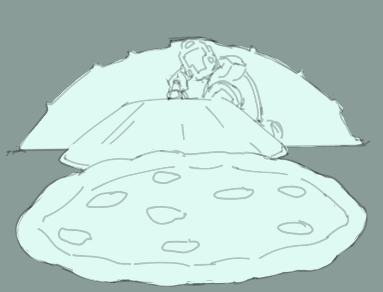

# Executioner Apple cobbler

A highly favored dessert in the mess halls of the Aeolan Confederacy. Just as sweet and rich as the victory that warranted the feast.

- Makes: 4-8 servings

## Ingredients:

- 4 apples (granny smith or whatever) slice into quarter inch or so pieces
- 1 cup water or apple juice
- 1/3 cup brown sugar , packed
- 1 Tablespoon cornstarch
- 1 Tablespoon lemon juice
- 1/2 teaspoon vanilla extract
- 1 teaspoon ground cinnamon
- 1/2 teaspoon ground nutmeg
- 1/8 teaspoon salt
For the batter:
- 1 cup all-purpose flour
- 1 cup granulated sugar
- 2 teaspoons baking powder
- 1/4 teaspoon salt
- 3/4 cup milk
- 5 Tablespoons butter , melted
- ground cinnamon for topping

## Directions:

### Apple Filling:

1. Stir together water, brown sugar, cornstarch, lemon juice, vanilla, cinnamon, nutmeg, and salt in a large saucepan.
2. Stir in apples.
3. Cook over medium heat for 3-5 minutes.

### Batter:

1. In a large bowl mix together the flour, sugar, baking powder, and salt.
2. Stir in the milk and melted butter, just until combined.

### Assembly:

1. Pour the apple filling into whatever oven safe dish will fit it and then pour the batter over it.
2. Sprinkle some cinnamon and bake at 400 for 45 minutes or until a knife inserted into the middle passes through clean.