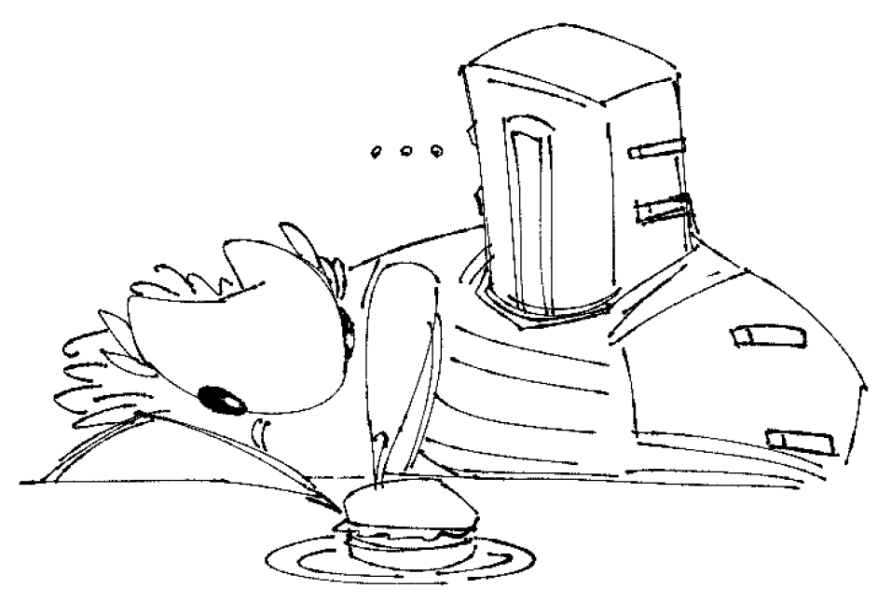

# Nemesis Lemonade Slush

Said to be the creation of a fallen god when their lemonade stand was destroyed by an arrogant interloper. This slush may seem like its the stuff of legends, but it is actually the stuff of easy to find cargo shipments.

- Makes 4-6 servings

## Ingredients:

- 600g frozen berries
- Juice of 2 and a half lemons
- Juice of half a lime
- Pinch of salt
- 3 tbsp of a dark honey (or agave nectar)
- Ice cubes
- 225ml soda water (but regular water is ok too)

## Directions:

1. Blend everything in a blender and serve immediately.

### Notes:

- Stick with the classic berries like raspberry, blueberry, blackberry, and strawberry. Ideally the former 3 for their higher tarntness
- You can also use yuzu here if you'd like!
- Adjust the honey to your ideal taste
