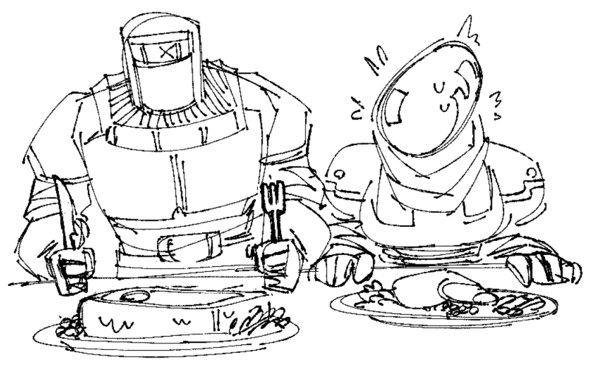

# Nemesuis Mule

A stranger was quoted this as finding the recipe for this scribbled on a note left behind at their shop in place of cash. Regardless of where it came from, it sure is delicious way to cure those ethereal blues.

## Ingredients:

- 1.5 oz Vodka (or opt out of the vodka and sub for some fruit juice)
- 5 oz Coca-Cola
- 1/2 oz yuzu juice (you can use concentrate just make sure to dilute)
- 1 oz Ginger Beer (get the real shit not Canada Dry)
- Tiny pinch of salt

## Directions:

1. In your drinking vessel add ice.
2. Combine the vodka, coke, yuzu juice, ginger beer, and salt to the vessel.
3. Stir and enjoy.

### Notes:

- Nemesis survivors do NOT like Pepsi or Pepsi-Co owned products
- You can switch out the coke for a health gut soda like Olipop or Poppi, but might not taste as good (and you already have vodka....)