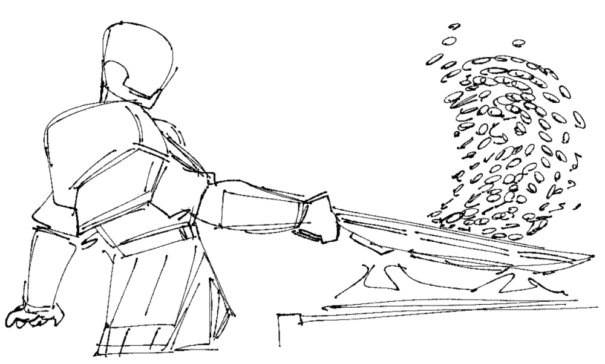

# Baroness Breakfast Burritos

- Makes 5-7 servings

## Ingredients:

- 5-7 tortillas of your choosing. Ideally bigger variety so the burritos arent bursting
- 12oz of ground meat (vegan or real)
- 1 yellow onion
- 2 cloves garlic
- 1 bell pepper
- 1 15oz can black beans
- Soy sauce
- Adobo seasoning
- Honey (to taste)
- Salt (to taste)
- Half a lime
- (Optional) 1 bay leaf
- (Optional) 1/2 cup of salsa
- (Optional) 1 can of corn

## Directions:

1. Grab a pot and place beans with liquid in on low. Add soy sauce, adobo, honey, and salt to taste. Let simmer while you cook the rest or until the beans have thickned and most liquid is gone.
2. Dice the onion and bell pepper. Mince the
3. Place half the diced onions and the corn/bay leaf (if you have) in the pot with the beans.
4. In a separate pan, cook the ground meat with the rest of the onions and bell pepper.
5. Season the meat with soy sauce, adobo, and salt to taste.
6. Squeeze the lime over the meat after it is cooked. Add garlic at this point too.
7. IMPORTANT! (so they dont get soggy). Place your cooked protein flat on a plate and put it in the fridge. It is important no heat is left so it doesnt make the tortilla soggy when stored
8. Repeat the same step for your beans (place in a bowl instead of plate)
9. Once everything is cooled, assemble your burritos. Place the protein, beans, and salsa in the tortilla. Wrap in aluminum foil and place in the freezer. Place burrito in fridge the day before you plan to eat it.

## Notes:

- You can also throw rice in here too just in keep in mind these will be STUFFED if you do.
- You can swap out the ground meat for more beans if you'd like.
- Tomato paste is also a nice addition to the beans if you want a thicker consistency.
- I don't have cheese or sour cream since its mixed on how well it freezes/thaws, and I am trying to keep saturated fats low. If you want to add it, I would recommend adding layering it on top of the meat during assembly.